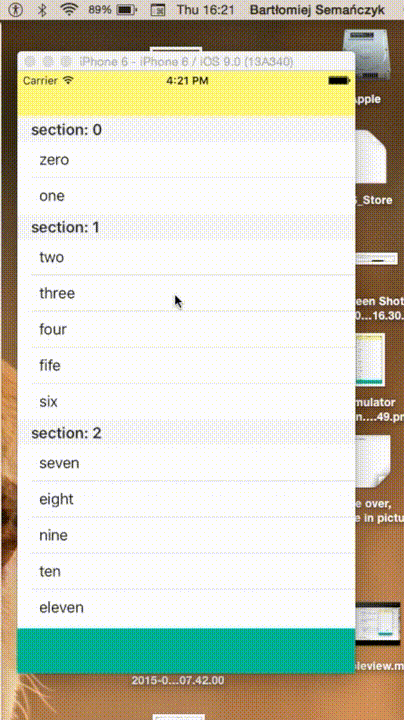

<br />

# BSTableViewReorder



## Installation

BSTableViewReorder is available through [CocoaPods](http://cocoapods.org). To install
it, simply add the following line to your Podfile:

```ruby
pod "BSTableViewReorder"
```

If you used `use_framework` in your podfile just simply do:

```Swift
import BSTableViewReorder

```

for every file when you need to use it.

you may also use:

```Swift
@import BSTableViewReorder

```

within **bridging header** file and avoid to import framework for every needed file.


##Info

- This library is not working with `UITableViewAutomaticDimension`
- entirely written in latest Swift syntax. Works with iOS 9 and Xcode7

##Usage

1. Simply add `BSTableViewReorder` as a subclass of your `UITableView` in Interface Builder.

2. Implement `tableView:moveRowAtIndexPath:toIndexPath` of the `UITableViewDataSource` protocol:

```Swift
func tableView(tableView: UITableView, moveRowAtIndexPath sourceIndexPath: NSIndexPath, toIndexPath destinationIndexPath: NSIndexPath) {

    let obj = data[sourceIndexPath.section][sourceIndexPath.row]
    data[sourceIndexPath.section].removeAtIndex(sourceIndexPath.row)
    data[destinationIndexPath.section].insert(obj, atIndex: destinationIndexPath.row)
}
```


#####Basic usage for `UITableView` with one section:

*...nothing to do more...*

#####Basic usage for `UITableView` with multiply sections:

Pay attention of every method using `indexPath`. Since table must always be up to date with data source, you need to care about this. `BSTableViewReorder` do it for you. All you need to do is to adopt 2 methods: `adaptedIndexPathForRowAtIndexPath:` and `adaptedNumberOfRowsInSection:witNumberOfRows:` in your `UITableViewDelegate` protocol's methods:

```Swift
func tableView(tableView: UITableView, numberOfRowsInSection section: Int) -> Int {
    return self.tableView.adaptedNumberOfRowsInSection(section, withNumberOfRows: data[section].count)
}

func tableView(tableView: UITableView, cellForRowAtIndexPath indexPath: NSIndexPath) -> UITableViewCell {

    let cell = tableView.dequeueReusableCellWithIdentifier(CellIdentifier, forIndexPath: indexPath) as! BSTableViewCell
    let adaptedIndexPath = self.tableView.adaptedIndexPathForRowAtIndexPath(indexPath)

    cell.label?.text = data[adaptedIndexPath.section][adaptedIndexPath.row]

    return cell
}

```

#####Customize the way you work with `BSTableViewReorder` using `BSTableViewReorderDelegate`:

```Swift
@objc public protocol BSTableViewReorderDelegate: class, UITableViewDelegate {
    
    optional var tableViewCanReorder: Bool { get set }
    optional var snapshotOpacity: Float { get set }
    
    optional func tableViewDidStartLongPress(gestureRecognizer: UILongPressGestureRecognizer)
    optional func tableViewDidEndLongPress(gestureRecognizer: UILongPressGestureRecognizer)
    optional func transformForSnapshotOfReorderingCellAtIndexPath(indexPath: NSIndexPath) -> CATransform3D
}
```

First thing you need to do is assign your delegate object to `reorderDelegate` property. Below is example usage:

```Swift
var tableViewCanReorder: true //you can modify this value at runtime.
var snapshotOpacity = 0.7 //you can modify this value at runtime
@IBOutlet var tableView: BSTableViewReorder!

override func viewDidLoad() {
    super.viewDidLoad()

    tableView.reorderDelegate = self
}

func transformForSnapshotOfReorderingCellAtIndexPath(indexPath: NSIndexPath) -> CATransform3D {
    var transform = CATransform3DIdentity
    transform.m34 = CGFloat(1.0 / -1000)

    transform = CATransform3DRotate(transform, CGFloat(20*M_PI / 180), 0, 1, 0)
    transform = CATransform3DRotate(transform, CGFloat(-15*M_PI / 180), 1, 0, 0)
    transform = CATransform3DTranslate(transform, -20, 0, 100)

    return transform
}
```


## Author

Bartłomiej Semańczyk, bartekss2@icloud.com

## License

BSTableViewReorder is available under the MIT license. See the LICENSE file for more info.
